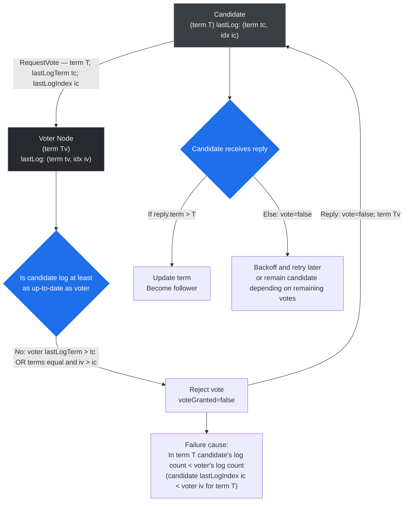

# Faulty Election Request

```mermaid
%%{init: {"themeVariables": {"fontSize":"16px"}}}%%
flowchart TD
  C["Candidate\n(term T) lastLog: (term tc, idx ic)"]
  V["Voter Node\n(term Tv)\nlastLog: (term tv, idx iv)"]

  C -->|RequestVote — term T; lastLogTerm tc; lastLogIndex ic| V

  V --> Compare{"Is candidate log at least\nas up-to-date as voter"}

  Compare -->|No: voter lastLogTerm &gt; tc OR terms equal and iv &gt; ic| Reject["Reject vote\nvoteGranted=false"]
  Reject --> Cause["Failure cause:\nIn term T candidate's log count &lt; voter's log count\n(candidate lastLogIndex ic &lt; voter iv for term T)"]
  Reject -->|Reply: vote=false; term Tv| C

  C --> Handle{"Candidate receives reply"}
  Handle -->|If reply.term &gt; T| StepDown["Update term\nBecome follower"]
  Handle -->|Else: vote=false| Backoff["Backoff and retry later\nor remain candidate depending on remaining votes"]

  classDef candidate fill:#3a3f44,stroke:#9aa0a6,stroke-width:1px,color:#f0f0f0;
  classDef voter fill:#26292d,stroke:#9aa0a6,stroke-width:1px,color:#f0f0f0;
  classDef decision fill:#1f6feb,stroke:#0b5bd7,stroke-width:1px,color:#ffffff;
  class C candidate;
  class V voter;
  class Compare,Handle decision;
```