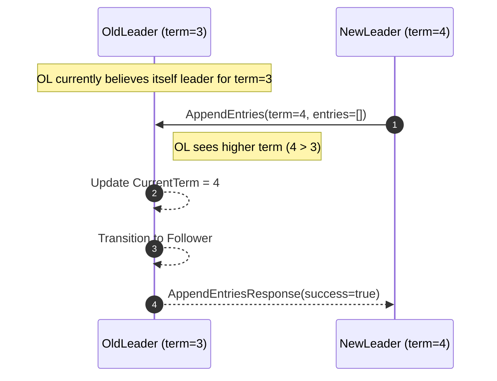

```mermaid
sequenceDiagram
  autonumber
  participant OL as OldLeader (term=3)
  participant NL as NewLeader (term=4)

  Note over OL: OL currently believes itself leader for term=3
  NL->>OL: AppendEntries(term=4, entries=[])

  Note right of OL: OL sees higher term (4 > 3)
  OL-->>OL: Update CurrentTerm = 4
  OL-->>OL: Transition to Follower

  OL-->>NL: AppendEntriesResponse(success=true)
```

This sequence shows a leader at a lower term stepping down when it receives a heartbeat from a higher-term leader.

````