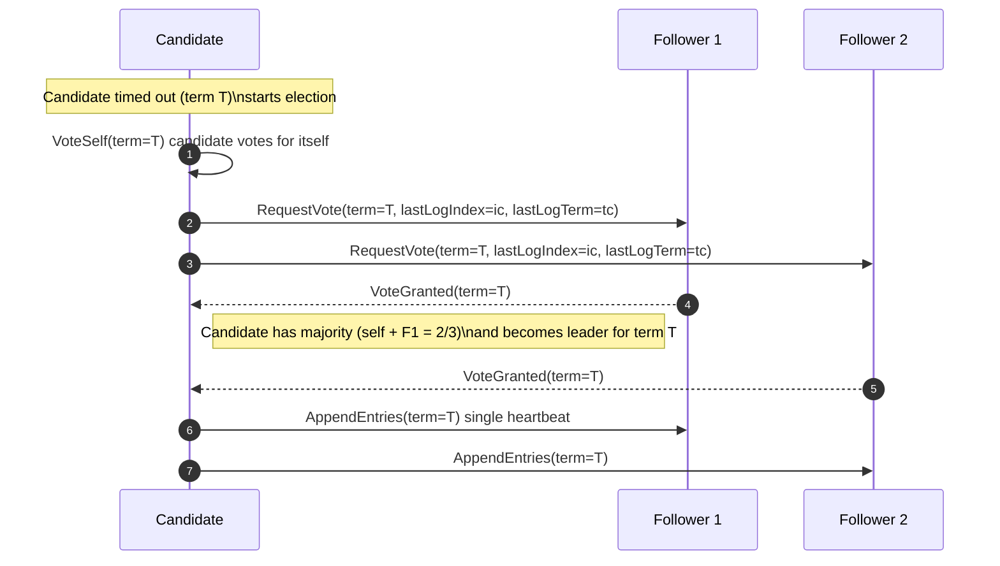

# Normal Election

This sequence shows a normal election: the candidate times out, requests votes from all servers, wins the election (majority), and sends a single heartbeat (AppendEntries) to establish leadership.
