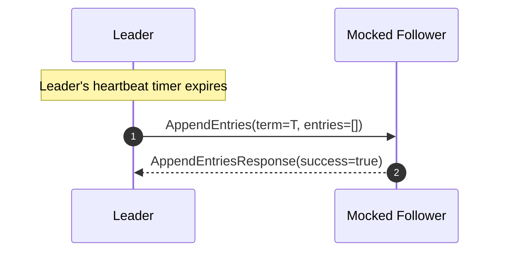

```mermaid
sequenceDiagram
  autonumber
  participant L as Leader
  participant M as Mocked Follower

  Note over L: Leader's heartbeat timer expires
  L->>M: AppendEntries(term=T, entries=[])

  M-->>L: AppendEntriesResponse(success=true)
```

This diagram shows the leader sending a periodic heartbeat (empty AppendEntries) to a mocked follower when the heartbeat timer fires.

````