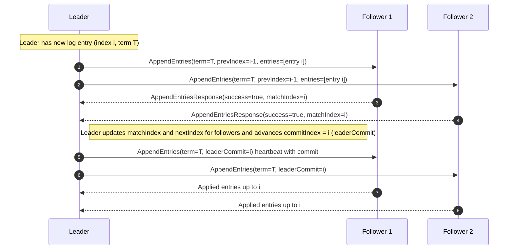

# Replicating Follower Logs (heartbeat + entry replication)

This sequence shows a leader replicating a single log entry to two followers (three-node cluster), followers accepting the entry, and the leader updating replication indexes and sending a heartbeat.
