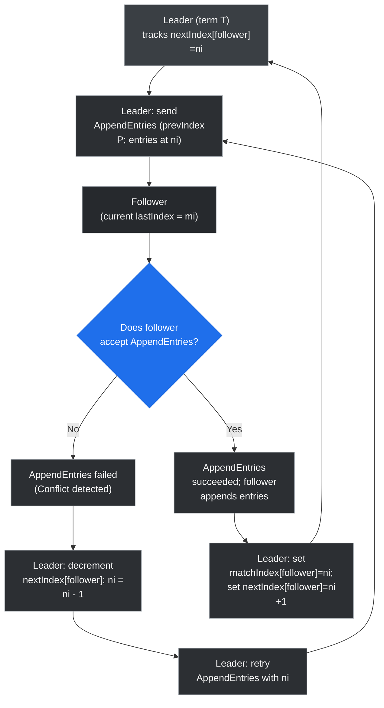

# Rewriting Follower Logs (AppendEntries retry)

This flowchart shows the leader's retry logic when an `AppendEntries` RPC fails due to log inconsistency: the leader decrements the follower's `nextIndex` and retries until the follower accepts the entries, then updates `matchIndex` and `nextIndex` accordingly.
