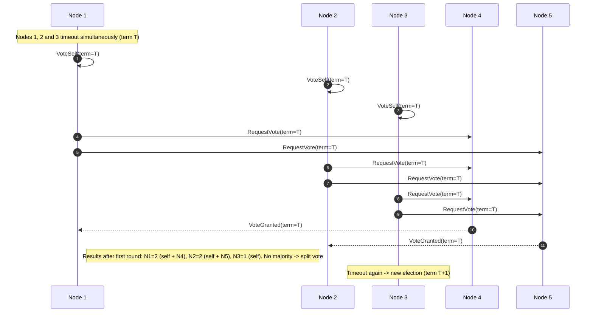

# Split Election (5 nodes)

This diagram shows a split election among five nodes: three nodes time out simultaneously and each votes for itself; followers split their votes so no candidate reaches a majority. Later, Node 3 times out again in a higher term, requests votes, wins the majority, and issues a heartbeat to establish leadership.
