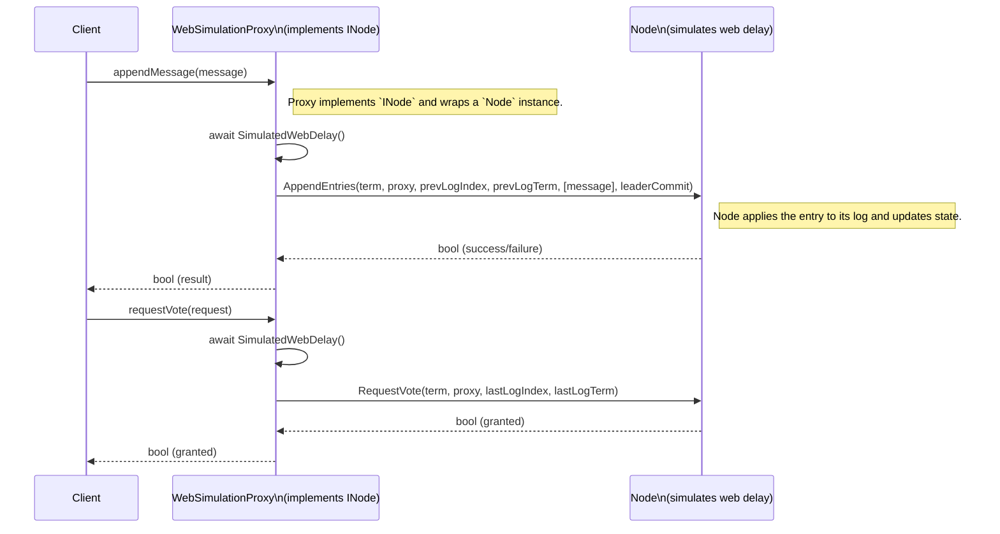

## WebSimulationProxy — appendMessage flow

This diagram shows how an `appendMessage` call (modeled as `AppendEntries`) flows through a WebSimulation proxy that implements `INode` and contains an actual `Node` instance which simulates web delay by awaiting before forwarding requests.

Notes:
- The `WebSimulationProxy` implements `INode` and delegates calls to the contained `Node` after simulating network latency.
- `SimulatedWebDelay()` can be implemented with `Task.Delay(milliseconds)` to model variable web delays.
