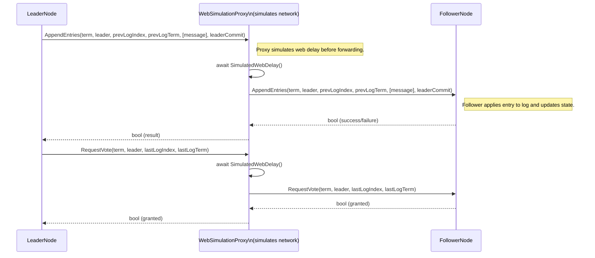

## WebSimulationProxy — appendMessage flow (leader -> follower via proxy)

This diagram shows an `AppendEntries` call flowing from one Raft node (leader) to another (follower) through a `WebSimulationProxy`. The proxy simulates network latency by awaiting before forwarding the request.

Notes:
- The `WebSimulationProxy` stands between two `INode` implementations and simulates network latency (e.g. `await Task.Delay(ms)`) before forwarding calls.
- Use the proxy to test timing-related Raft behaviors (log replication, election timeouts, split votes).

If you want, I can also add a small example `WebSimulationProxy` implementation in `raftLibrary` to demonstrate `Task.Delay`-based latency.
