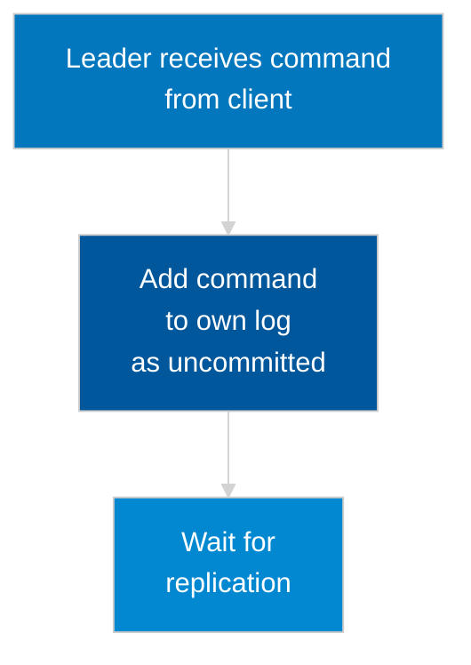

# TC1: Leader Receives Command

```mermaid
%%{init: {'theme': 'dark'}}%%
graph TD
    A["Leader receives command<br/>from client"] --> B["Add command<br/>to own log<br/>as uncommitted"]
    B --> C["Wait for<br/>replication"]
    
    style A fill:#0277bd,color:#fff
    style B fill:#01579b,color:#fff
    style C fill:#0288d1,color:#fff
```
