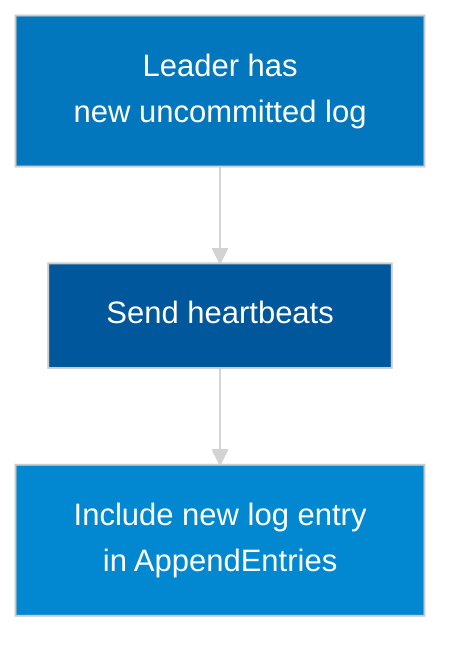

# TC2: Leader Sends Heartbeats

```mermaid
%%{init: {'theme': 'dark'}}%%
graph TD
    A["Leader has<br/>new uncommitted log"] --> B["Send heartbeats"] --> C["Include new log entry<br/>in AppendEntries"]
    
    style A fill:#0277bd,color:#fff
    style B fill:#01579b,color:#fff
    style C fill:#0288d1,color:#fff
```
