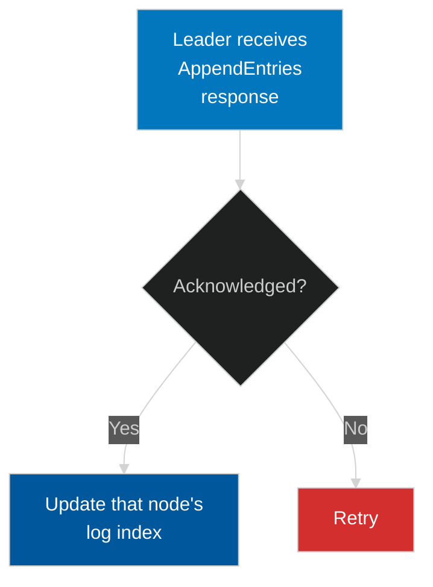

# TC3: Leader Receives Follower Confirmation

```mermaid
%%{init: {'theme': 'dark'}}%%
graph TD
    A["Leader receives<br/>AppendEntries<br/>response"] --> B{Acknowledged?}
    B -->|Yes| C["Update that node's<br/>log index"]
    B -->|No| D["Retry"]
    
    style A fill:#0277bd,color:#fff
    style C fill:#01579b,color:#fff
    style D fill:#d32f2f,color:#fff
```
