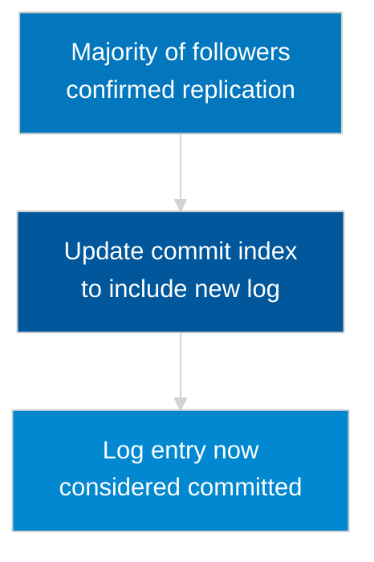

# TC4: Leader Achieves Majority

```mermaid
%%{init: {'theme': 'dark'}}%%
graph TD
    A["Majority of followers<br/>confirmed replication"] --> B["Update commit index<br/>to include new log"]
    B --> C["Log entry now<br/>considered committed"]
    
    style A fill:#0277bd,color:#fff
    style B fill:#01579b,color:#fff
    style C fill:#0288d1,color:#fff
```
