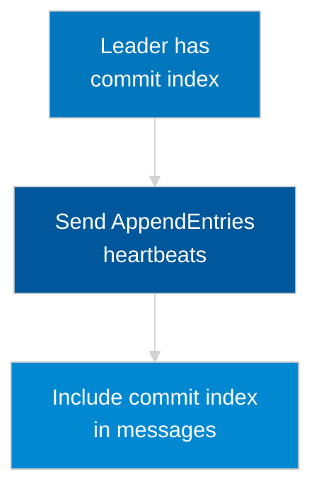

# TC5: Leader Has Commit Index

```mermaid
%%{init: {'theme': 'dark'}}%%
graph TD
    A["Leader has<br/>commit index"] --> B["Send AppendEntries<br/>heartbeats"]
    B --> C["Include commit index<br/>in messages"]
    
    style A fill:#0277bd,color:#fff
    style B fill:#01579b,color:#fff
    style C fill:#0288d1,color:#fff
```
