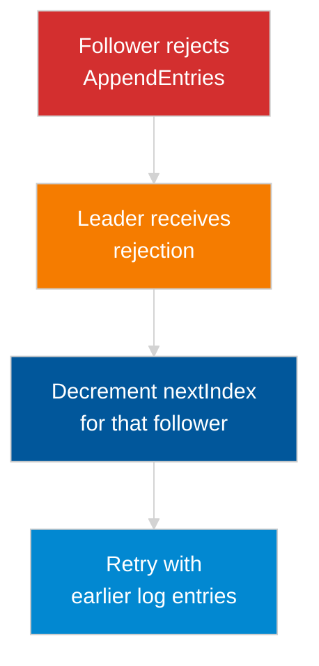

# TC6: Leader Receives Rejection

```mermaid
%%{init: {'theme': 'dark'}}%%
graph TD
    A["Follower rejects<br/>AppendEntries"] --> B["Leader receives<br/>rejection"]
    B --> C["Decrement nextIndex<br/>for that follower"]
    C --> D["Retry with<br/>earlier log entries"]
    
    style A fill:#d32f2f,color:#fff
    style B fill:#f57c00,color:#fff
    style C fill:#01579b,color:#fff
    style D fill:#0288d1,color:#fff
```
