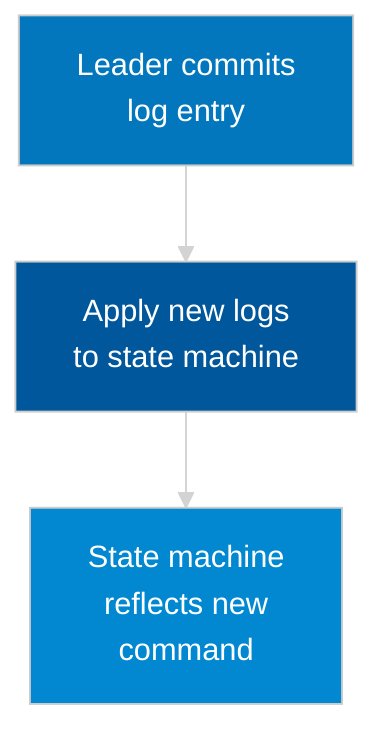

# TC8: Leader Applies to State Machine

```mermaid
%%{init: {'theme': 'dark'}}%%
graph TD
    A["Leader commits<br/>log entry"] --> B["Apply new logs<br/>to state machine"]
    B --> C["State machine<br/>reflects new<br/>command"]
    
    style A fill:#0277bd,color:#fff
    style B fill:#01579b,color:#fff
    style C fill:#0288d1,color:#fff
```
