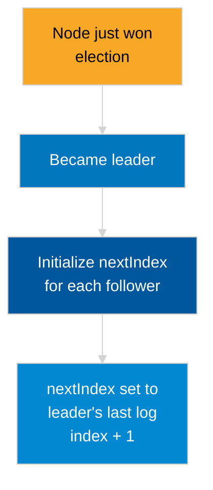

# TC9: Leader Just Won Election

```mermaid
%%{init: {'theme': 'dark'}}%%
graph TD
    A["Node just won<br/>election"] --> B["Became leader"]
    B --> C["Initialize nextIndex<br/>for each follower"]
    C --> D["nextIndex set to<br/>leader's last log<br/>index + 1"]
    
    style A fill:#f9a825,color:#000
    style B fill:#0277bd,color:#fff
    style C fill:#01579b,color:#fff
    style D fill:#0288d1,color:#fff
```
