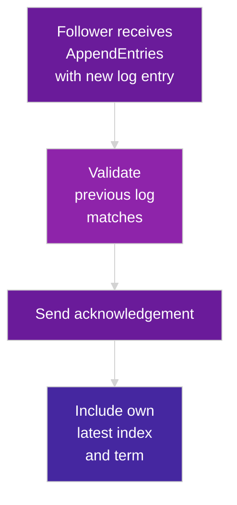

# TC10: Follower Receives AppendEntries

```mermaid
%%{init: {'theme': 'dark'}}%%
graph TD
    A["Follower receives<br/>AppendEntries<br/>with new log entry"] --> B["Validate<br/>previous log<br/>matches"]
    B --> C["Send acknowledgement"]
    C --> D["Include own<br/>latest index<br/>and term"]
    
    style A fill:#6a1b9a,color:#fff
    style B fill:#8e24aa,color:#fff
    style C fill:#6a1b9a,color:#fff
    style D fill:#4527a0,color:#fff
```
