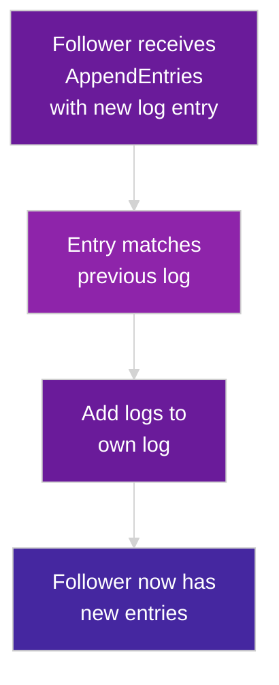

# TC11: Follower Adds Logs

```mermaid
%%{init: {'theme': 'dark'}}%%
graph TD
    A["Follower receives<br/>AppendEntries<br/>with new log entry"] --> B["Entry matches<br/>previous log"]
    B --> C["Add logs to<br/>own log"]
    C --> D["Follower now has<br/>new entries"]
    
    style A fill:#6a1b9a,color:#fff
    style B fill:#8e24aa,color:#fff
    style C fill:#6a1b9a,color:#fff
    style D fill:#4527a0,color:#fff
```
