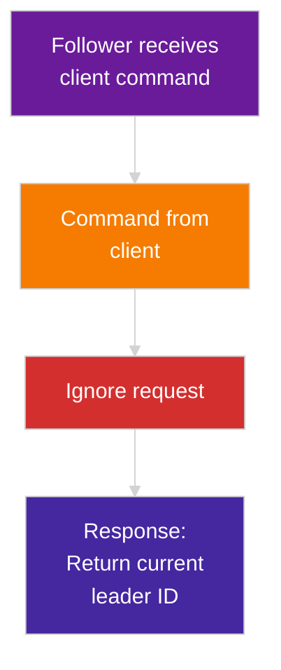

# TC12: Follower Ignores Client Command

```mermaid
%%{init: {'theme': 'dark'}}%%
graph TD
    A["Follower receives<br/>client command"] --> B["Command from<br/>client"]
    B --> C["Ignore request"]
    C --> D["Response:<br/>Return current<br/>leader ID"]
    
    style A fill:#6a1b9a,color:#fff
    style B fill:#f57c00,color:#fff
    style C fill:#d32f2f,color:#fff
    style D fill:#4527a0,color:#fff
```
