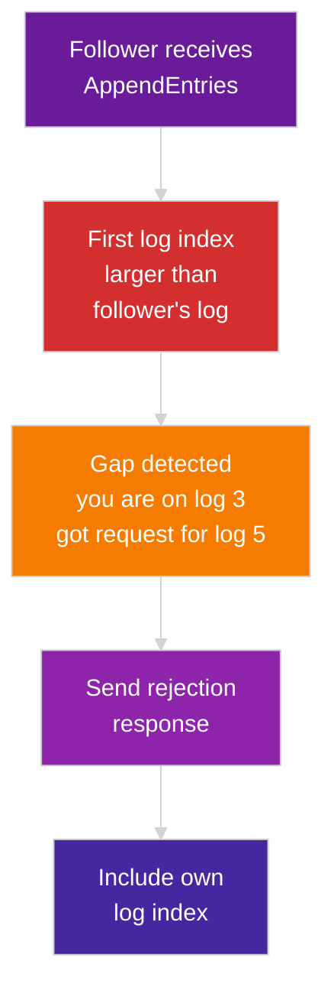

# TC13: Follower Detects Gap in Logs

```mermaid
%%{init: {'theme': 'dark'}}%%
graph TD
    A["Follower receives<br/>AppendEntries"] --> B["First log index<br/>larger than<br/>follower's log"]
    B --> C["Gap detected<br/>you are on log 3<br/>got request for log 5"]
    C --> D["Send rejection<br/>response"]
    D --> E["Include own<br/>log index"]
    
    style A fill:#6a1b9a,color:#fff
    style B fill:#d32f2f,color:#fff
    style C fill:#f57c00,color:#fff
    style D fill:#8e24aa,color:#fff
    style E fill:#4527a0,color:#fff
```
