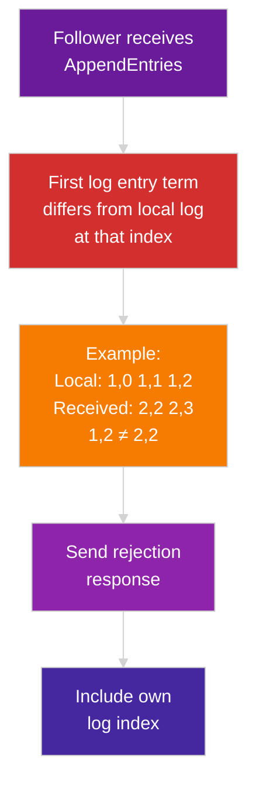

# TC14: Follower Detects Term Mismatch

```mermaid
%%{init: {'theme': 'dark'}}%%
graph TD
    A["Follower receives<br/>AppendEntries"] --> B["First log entry term<br/>differs from local log<br/>at that index"]
    B --> C["Example:<br/>Local: 1,0 1,1 1,2<br/>Received: 2,2 2,3<br/>1,2 ≠ 2,2"]
    C --> D["Send rejection<br/>response"]
    D --> E["Include own<br/>log index"]
    
    style A fill:#6a1b9a,color:#fff
    style B fill:#d32f2f,color:#fff
    style C fill:#f57c00,color:#fff
    style D fill:#8e24aa,color:#fff
    style E fill:#4527a0,color:#fff
```
