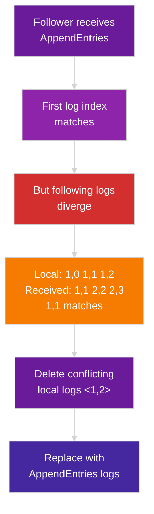

# TC15: Follower Reconciles Diverged Logs

```mermaid
%%{init: {'theme': 'dark'}}%%
graph TD
    A["Follower receives<br/>AppendEntries"] --> B["First log index<br/>matches"]
    B --> C["But following logs<br/>diverge"]
    C --> D["Local: 1,0 1,1 1,2<br/>Received: 1,1 2,2 2,3<br/>1,1 matches"]
    D --> E["Delete conflicting<br/>local logs <1,2>"]
    E --> F["Replace with<br/>AppendEntries logs"]
    
    style A fill:#6a1b9a,color:#fff
    style B fill:#8e24aa,color:#fff
    style C fill:#d32f2f,color:#fff
    style D fill:#f57c00,color:#fff
    style E fill:#6a1b9a,color:#fff
    style F fill:#4527a0,color:#fff
```
