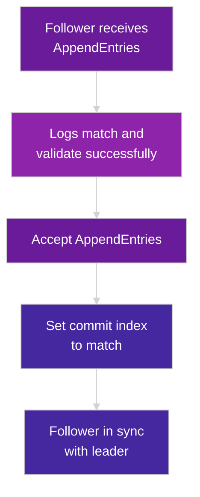

# TC16: Follower Accepts AppendEntries

```mermaid
%%{init: {'theme': 'dark'}}%%
graph TD
    A["Follower receives<br/>AppendEntries"] --> B["Logs match and<br/>validate successfully"]
    B --> C["Accept AppendEntries"]
    C --> D["Set commit index<br/>to match"]
    D --> E["Follower in sync<br/>with leader"]
    
    style A fill:#6a1b9a,color:#fff
    style B fill:#8e24aa,color:#fff
    style C fill:#6a1b9a,color:#fff
    style D fill:#4527a0,color:#fff
    style E fill:#4527a0,color:#fff
```
