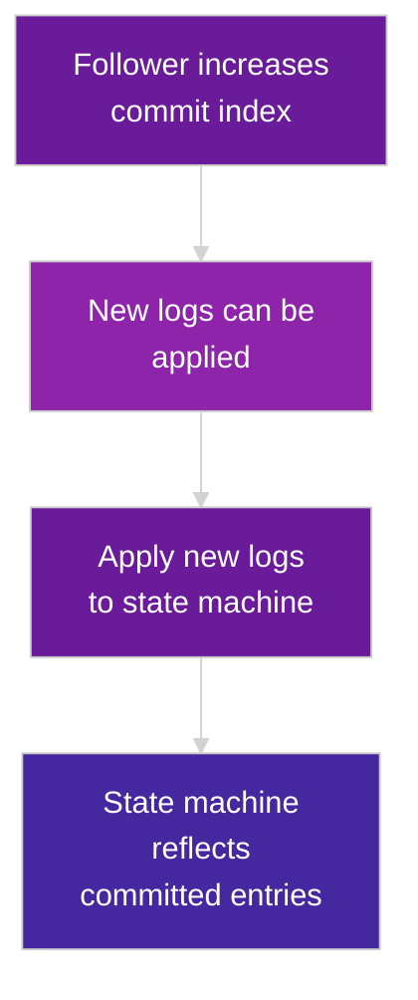

# TC17: Follower Applies to State Machine

```mermaid
%%{init: {'theme': 'dark'}}%%
graph TD
    A["Follower increases<br/>commit index"] --> B["New logs can be<br/>applied"]
    B --> C["Apply new logs<br/>to state machine"]
    C --> D["State machine<br/>reflects<br/>committed entries"]
    
    style A fill:#6a1b9a,color:#fff
    style B fill:#8e24aa,color:#fff
    style C fill:#6a1b9a,color:#fff
    style D fill:#4527a0,color:#fff
```
