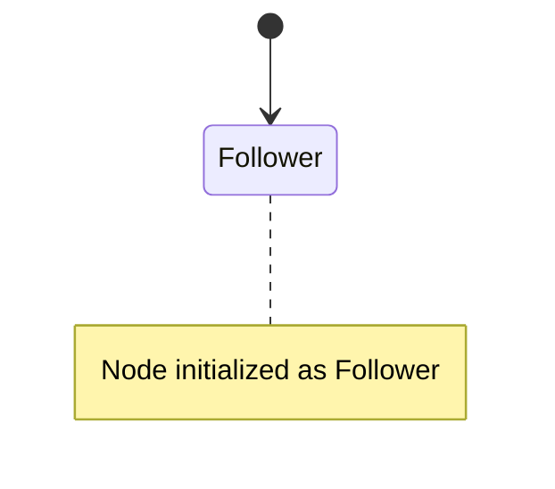

# Test Case 1: Single Node Starts

**Given:** a single node
**When:** the node has just started
**Then:** the node is a follower

## Diagram

```mermaid
stateDiagram-v2
    [*] --> Follower
    note right of Follower
        Node initialized as Follower
    end note
```
