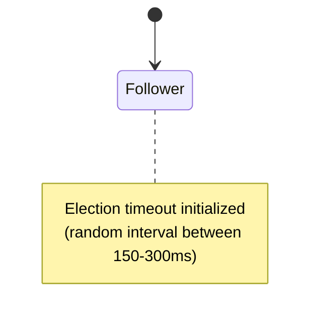

# Test Case 2: Single Node Sets Election Timeout

**Given:** a single node
**When:** the node has just started
**Then:** the node sets its election timeout

## Diagram

```mermaid
stateDiagram-v2
    [*] --> Follower
    note right of Follower
        Election timeout initialized
        (random interval between 150-300ms)
    end note
```
