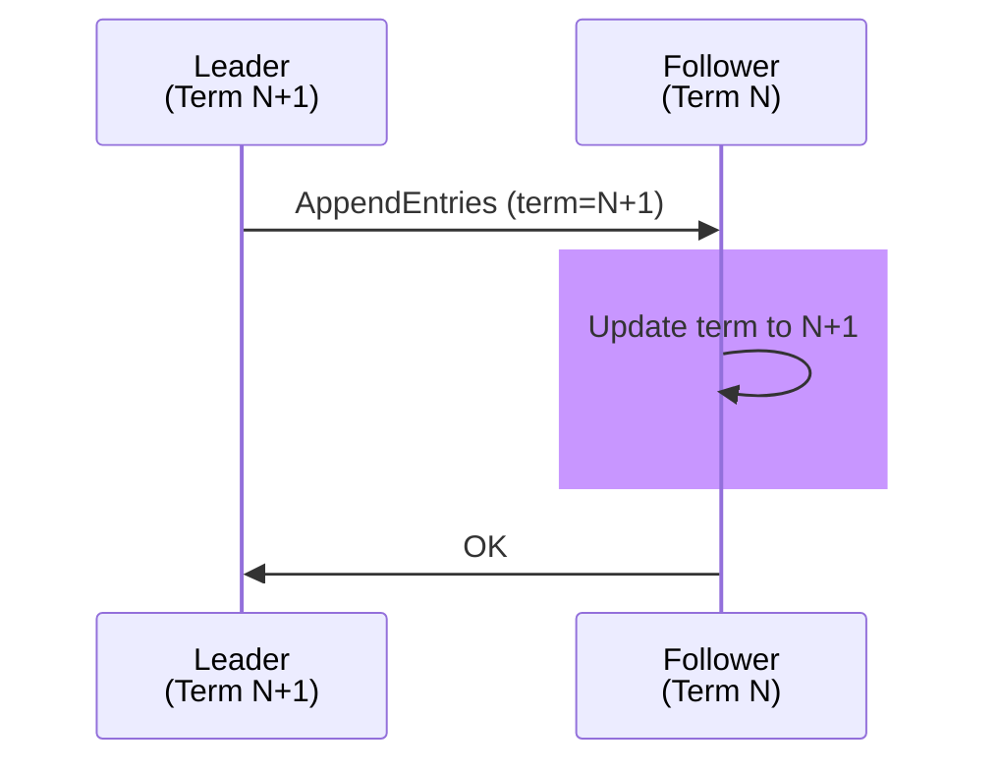

# Test Case 3: Follower Receives Higher Term Heartbeat

**Given:** you have a term as a follower
**When:** you receive a heartbeat that is a larger term
**Then:** you update your term

## Diagram

```mermaid
sequenceDiagram
    participant Leader as Leader<br/>(Term N+1)
    participant Follower as Follower<br/>(Term N)
    
    Leader->>Follower: AppendEntries (term=N+1)
    rect rgb(200, 150, 255)
        Follower->>Follower: Update term to N+1
    end
    Follower->>Leader: OK
```
