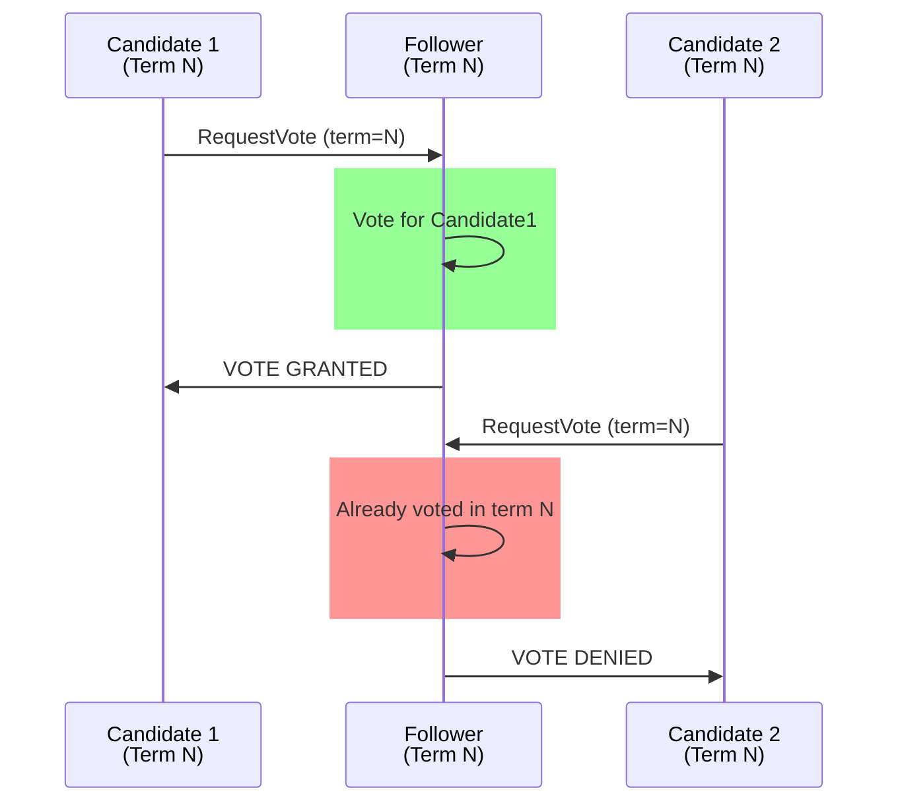

# Test Case 4: Follower Denies Duplicate Vote Request

**Given:** you are a follower that has already voted
**When:** you receive a request for vote (for the same term)
**Then:** you deny that request/vote

## Diagram

