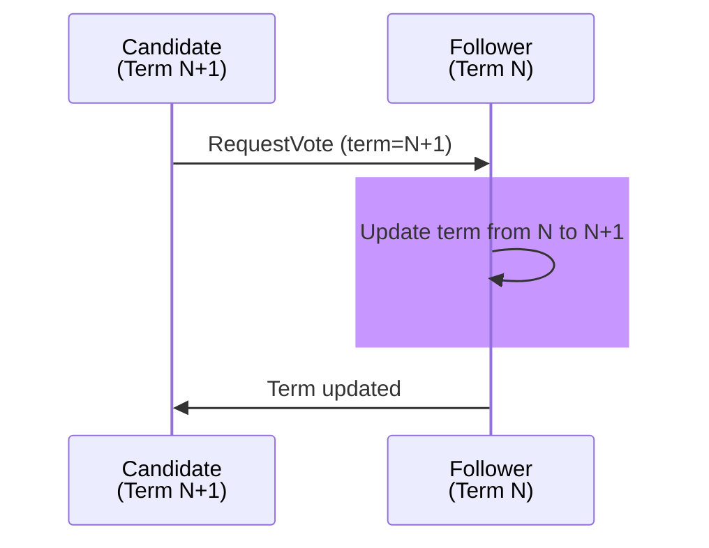

# Test Case 5: Follower Increments Term for Higher Vote Request

**Given:** you are a follower
**When:** you receive a request to vote for a higher term
**Then:** you increment your term

## Diagram

