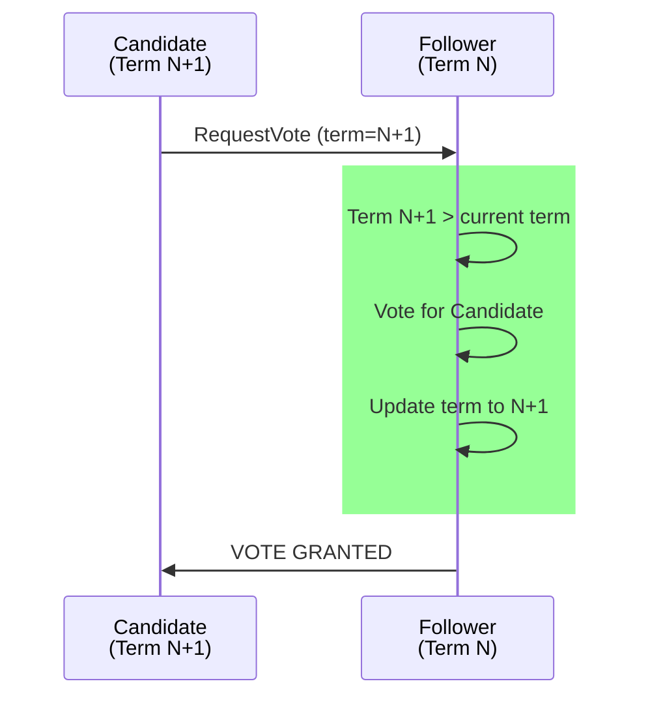

# Test Case 6: Follower Votes for Higher Term Requestor

**Given:** you are a follower
**When:** you receive a request to vote for a higher term
**Then:** vote for the requestor node

## Diagram

```mermaid
sequenceDiagram
    participant Candidate as Candidate<br/>(Term N+1)
    participant Follower as Follower<br/>(Term N)
    
    Candidate->>Follower: RequestVote (term=N+1)
    rect rgb(150, 255, 150)
        Follower->>Follower: Term N+1 > current term
        Follower->>Follower: Vote for Candidate
        Follower->>Follower: Update term to N+1
    end
    Follower->>Candidate: VOTE GRANTED
```
