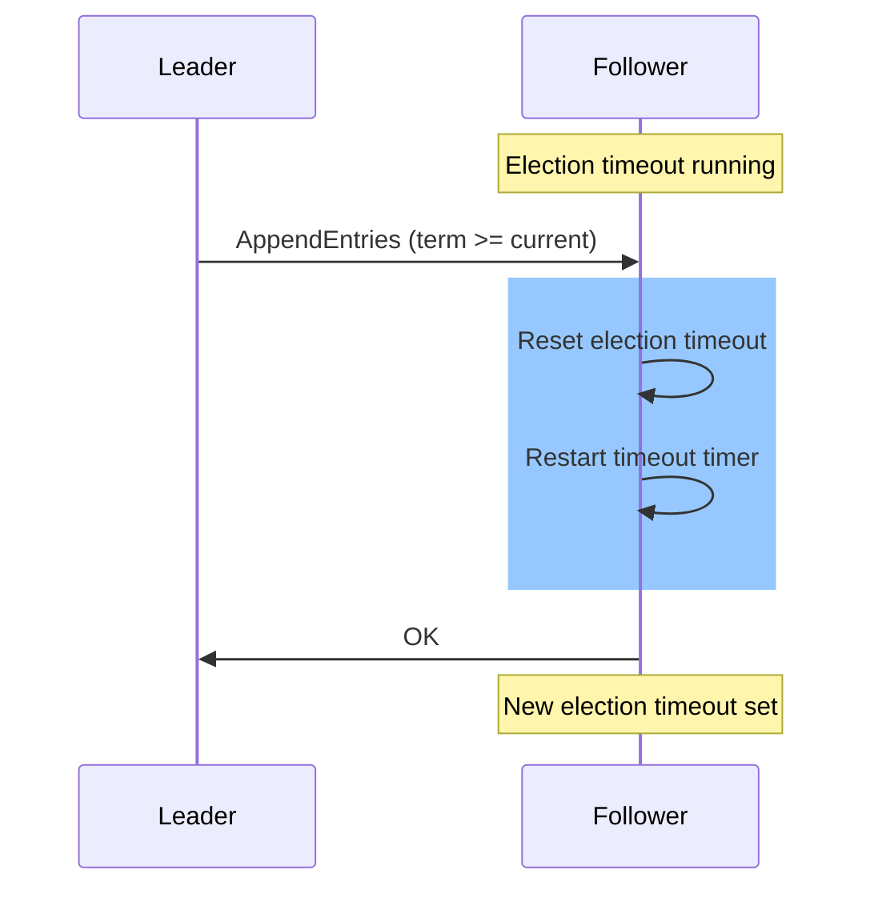

# Test Case 7: Follower Resets Timeout on Current/Future Term AppendEntries

**Given:** you are a follower
**When:** you receive an appendentries for current term or future term
**Then:** you reset your election timeout

## Diagram

