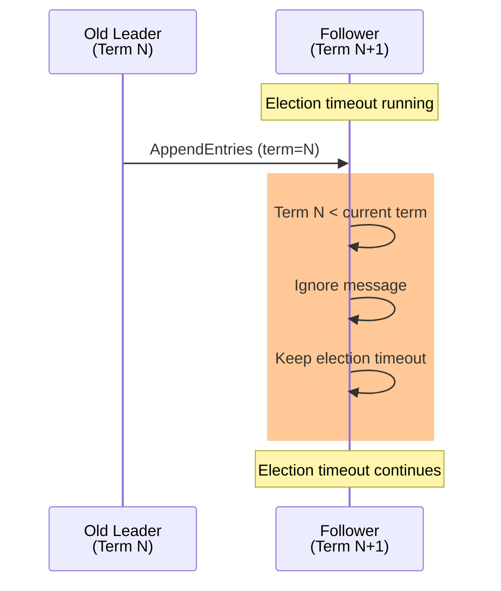

# Test Case 8: Follower Ignores Previous Term AppendEntries

**Given:** you are a follower
**When:** you receive an appendentries for previous term
**Then:** you do not reset your election timeout

## Diagram

