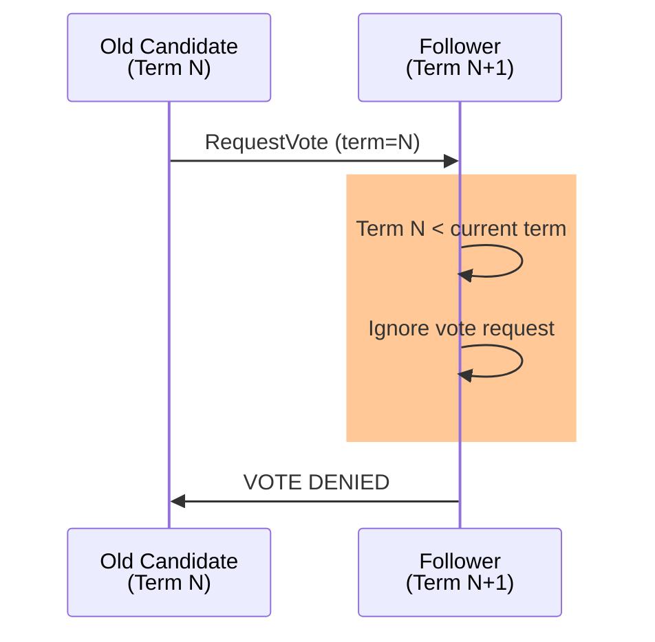

# Test Case 9: Follower Ignores Lower Term Vote Request

**Given:** you are a follower
**When:** you receive a request for vote for lower term
**Then:** you ignore it

## Diagram

```mermaid
sequenceDiagram
    participant OldCandidate as Old Candidate<br/>(Term N)
    participant Follower as Follower<br/>(Term N+1)
    
    OldCandidate->>Follower: RequestVote (term=N)
    rect rgb(255, 200, 150)
        Follower->>Follower: Term N < current term
        Follower->>Follower: Ignore vote request
    end
    Follower->>OldCandidate: VOTE DENIED
```
