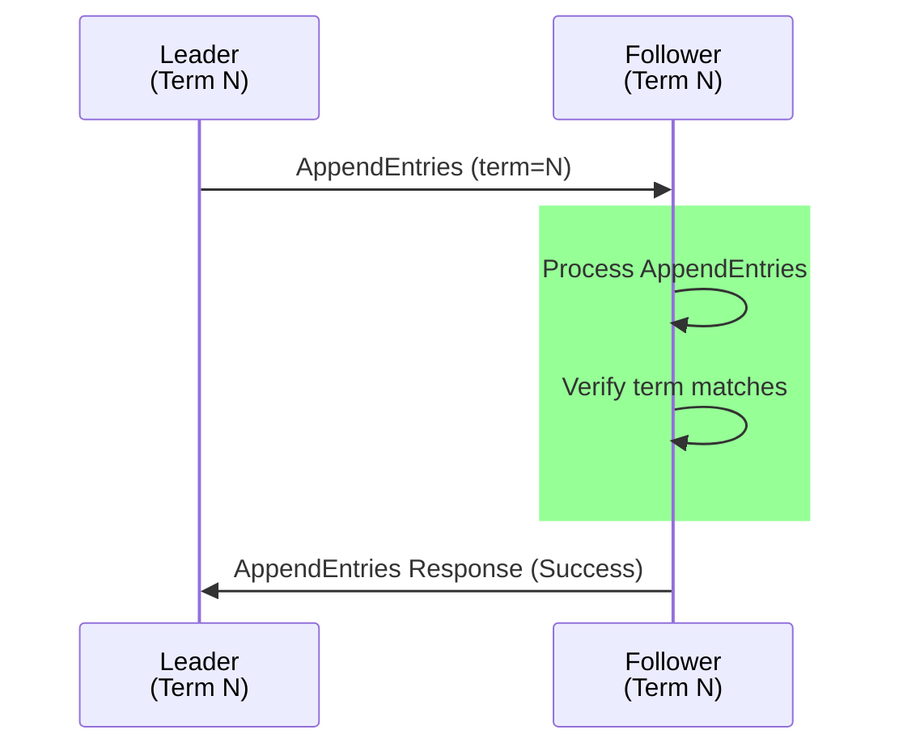

# Test Case 10: Follower Responds to Current Term AppendEntries

**Given:** you are a follower
**When:** you receive an AppendEntries request for the current term
**Then:** you send a response to the leader node

## Diagram

