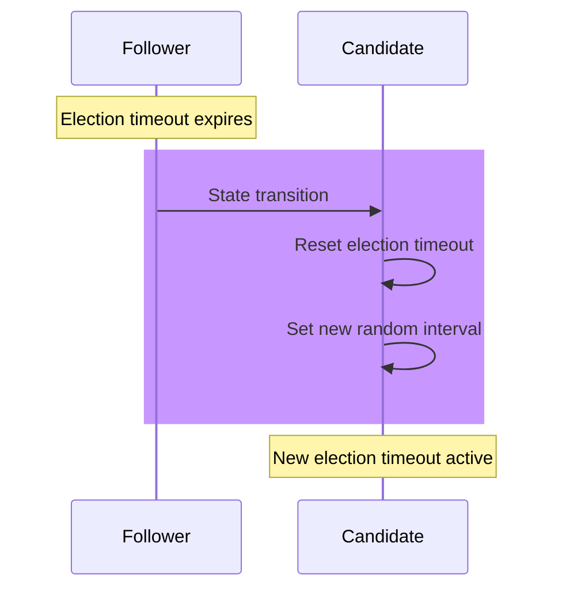

# Test Case 12: Candidate Resets Election Timeout

**Given:** you are a follower
**When:** you just became a candidate
**Then:** you reset your election timeout

## Diagram

```mermaid
sequenceDiagram
    participant Follower as Follower
    participant Candidate as Candidate
    
    Note over Follower: Election timeout expires
    rect rgb(200, 150, 255)
        Follower->>Candidate: State transition
        Candidate->>Candidate: Reset election timeout
        Candidate->>Candidate: Set new random interval
    end
    Note over Candidate: New election timeout active
```
