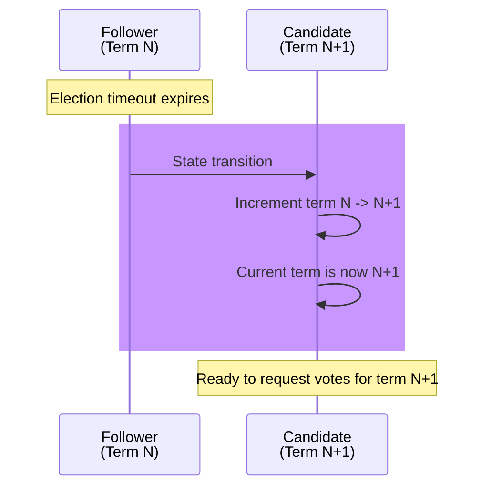

# Test Case 13: Candidate Increments Term on Conversion

**Given:** you are a follower
**When:** you just became a candidate
**Then:** you increment your term

## Diagram

```mermaid
sequenceDiagram
    participant Follower as Follower<br/>(Term N)
    participant Candidate as Candidate<br/>(Term N+1)
    
    Note over Follower: Election timeout expires
    rect rgb(200, 150, 255)
        Follower->>Candidate: State transition
        Candidate->>Candidate: Increment term N -> N+1
        Candidate->>Candidate: Current term is now N+1
    end
    Note over Candidate: Ready to request votes for term N+1
```
