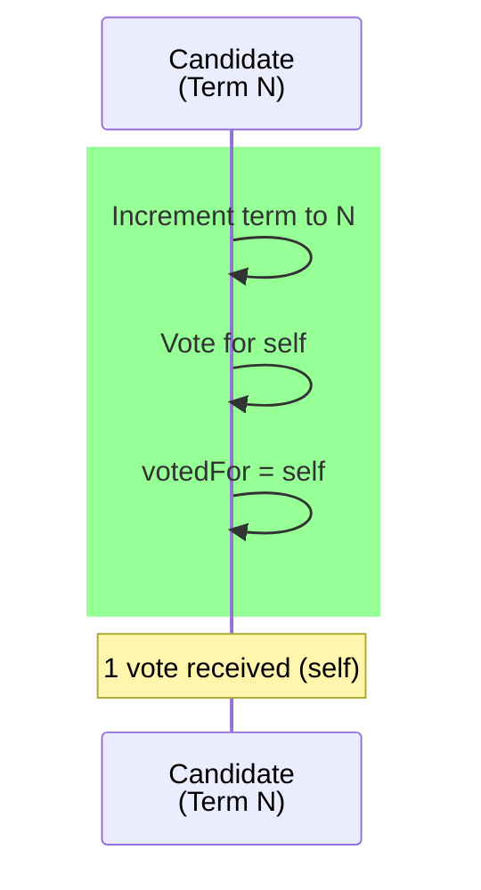

# Test Case 14: Candidate Votes for Itself

**Given:** you became a candidate
**When:** 
**Then:** you vote for yourself

## Diagram

```mermaid
sequenceDiagram
    participant Candidate as Candidate<br/>(Term N)
    
    rect rgb(150, 255, 150)
        Candidate->>Candidate: Increment term to N
        Candidate->>Candidate: Vote for self
        Candidate->>Candidate: votedFor = self
    end
    Note over Candidate: 1 vote received (self)
```
