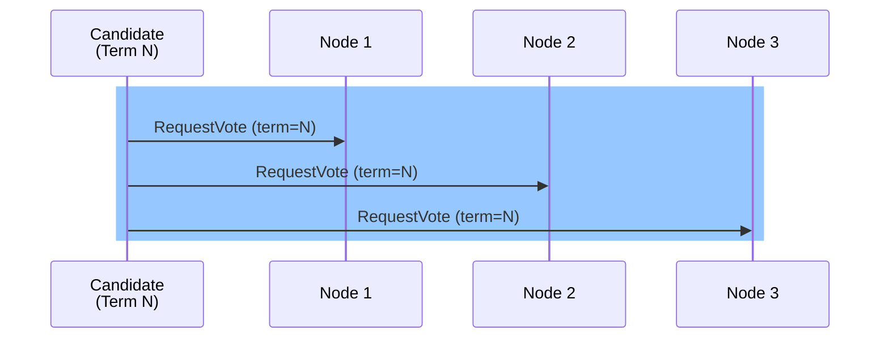

# Test Case 15: Candidate Sends Vote Requests to All Nodes

**Given:** you became a candidate
**When:**
**Then:** you send vote requests to all other nodes

## Diagram

```mermaid
sequenceDiagram
    participant Candidate as Candidate<br/>(Term N)
    participant Node1 as Node 1
    participant Node2 as Node 2
    participant Node3 as Node 3
    
    rect rgb(150, 200, 255)
        Candidate->>Node1: RequestVote (term=N)
        Candidate->>Node2: RequestVote (term=N)
        Candidate->>Node3: RequestVote (term=N)
    end
```
