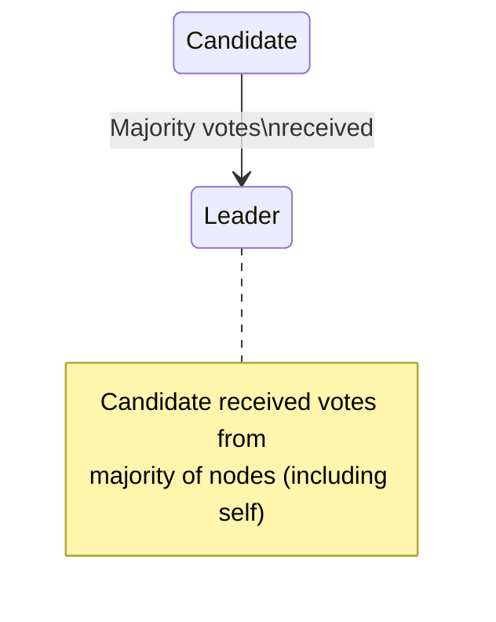

# Test Case 16: Candidate Becomes Leader on Majority Votes

**Given:** you are a candidate that has sent out votes
**When:** you have received a majority of vote responses (voting for you)
**Then:** you become a leader

## Diagram

