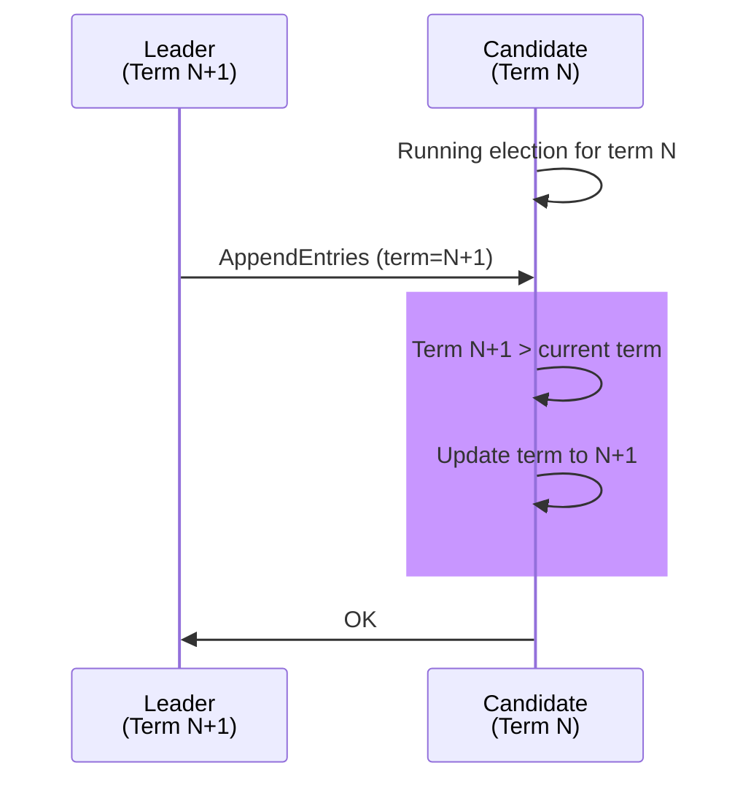

# Test Case 17: Candidate Receives Higher Term Heartbeat

**Given:** you have a term as a candidate
**When:** you receive a heartbeat that is a larger term
**Then:** you update your term

## Diagram

