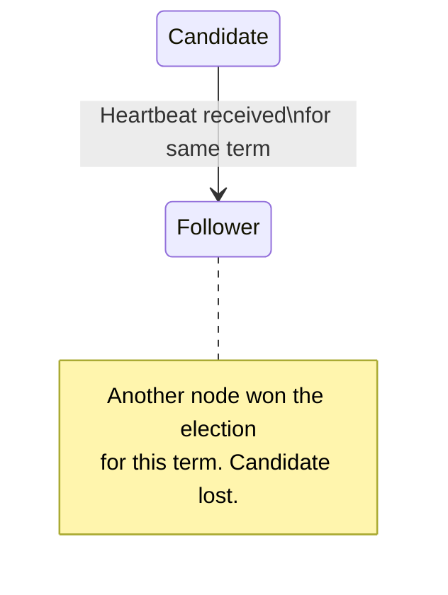

# Test Case 18: Candidate Becomes Follower on Same Term Heartbeat

**Given:** you have a term as a candidate
**When:** you receive a heartbeat that is the same term
**Then:** become a follower (you lost)

## Diagram

