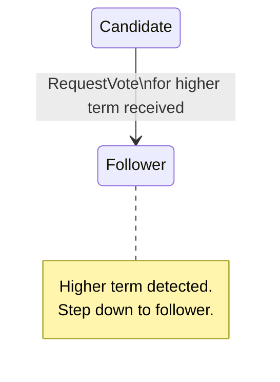

# Test Case 19: Candidate Becomes Follower on Higher Term Vote Request

**Given:** a candidate is in term N
**When:** it receives a request to vote in a higher term
**Then:** you become a follower

## Diagram

