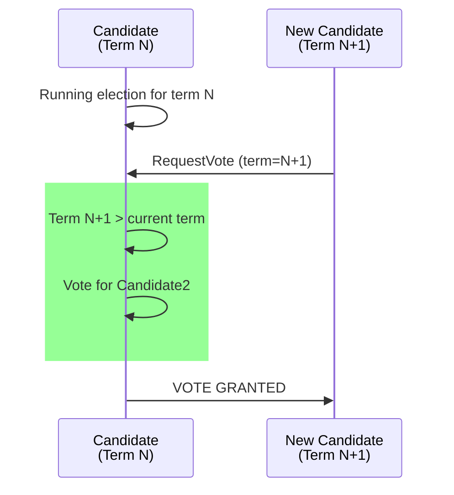

# Test Case 20: Candidate Votes for Higher Term Requestor

**Given:** a candidate is in term N
**When:** it receives a request to vote in a higher term
**Then:** you vote for the requestor node

## Diagram

