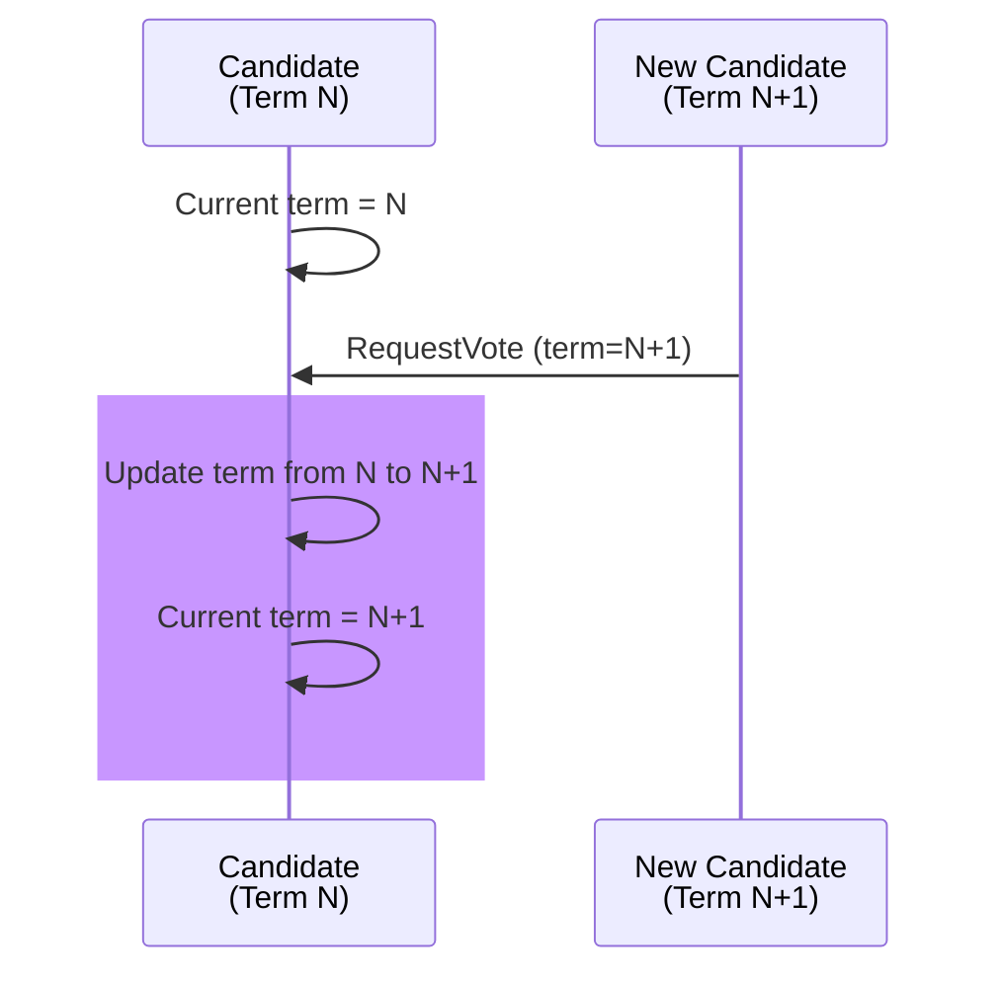

# Test Case 21: Candidate Updates Term on Higher Term Vote Request

**Given:** a candidate is in term N
**When:** it receives a request to vote in a higher term
**Then:** you update your term

## Diagram

