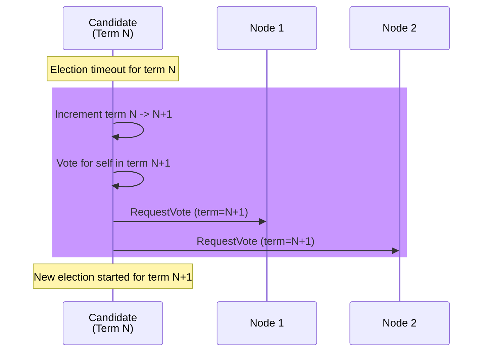

# Test Case 22: Candidate Starts New Election on Timeout

**Given:** you are a candidate
**When:** your election timeout triggers
**Then:** you start a new election

## Diagram

```mermaid
sequenceDiagram
    participant Candidate as Candidate<br/>(Term N)
    participant Node1 as Node 1
    participant Node2 as Node 2
    
    Note over Candidate: Election timeout for term N
    rect rgb(200, 150, 255)
        Candidate->>Candidate: Increment term N -> N+1
        Candidate->>Candidate: Vote for self in term N+1
        Candidate->>Node1: RequestVote (term=N+1)
        Candidate->>Node2: RequestVote (term=N+1)
    end
    Note over Candidate: New election started for term N+1
```
