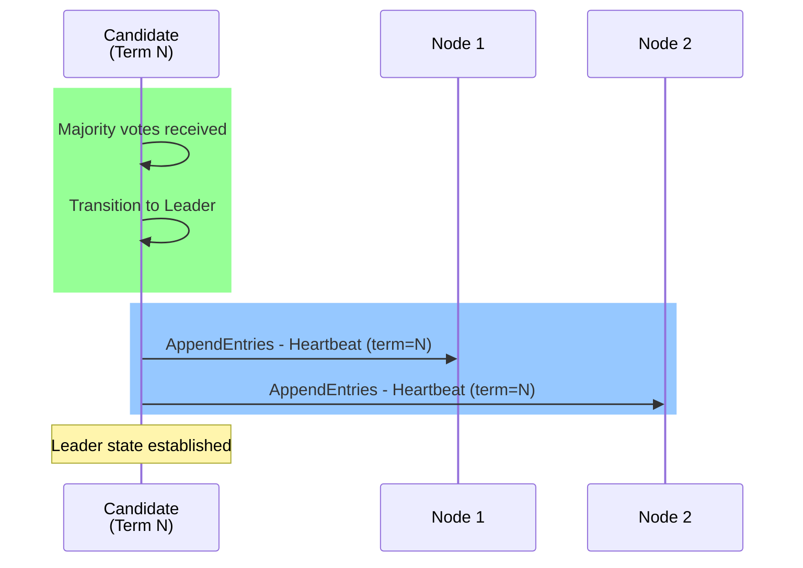

# Test Case 23: Leader Sends Heartbeat After Election Win

**Given:** a candidate wins an election
**When:**
**Then:** it immediately sends out a heartbeat

## Diagram

```mermaid
sequenceDiagram
    participant Candidate as Candidate<br/>(Term N)
    participant Node1 as Node 1
    participant Node2 as Node 2
    
    rect rgb(150, 255, 150)
        Candidate->>Candidate: Majority votes received
        Candidate->>Candidate: Transition to Leader
    end
    
    rect rgb(150, 200, 255)
        Candidate->>Node1: AppendEntries - Heartbeat (term=N)
        Candidate->>Node2: AppendEntries - Heartbeat (term=N)
    end
    Note over Candidate: Leader state established
```
