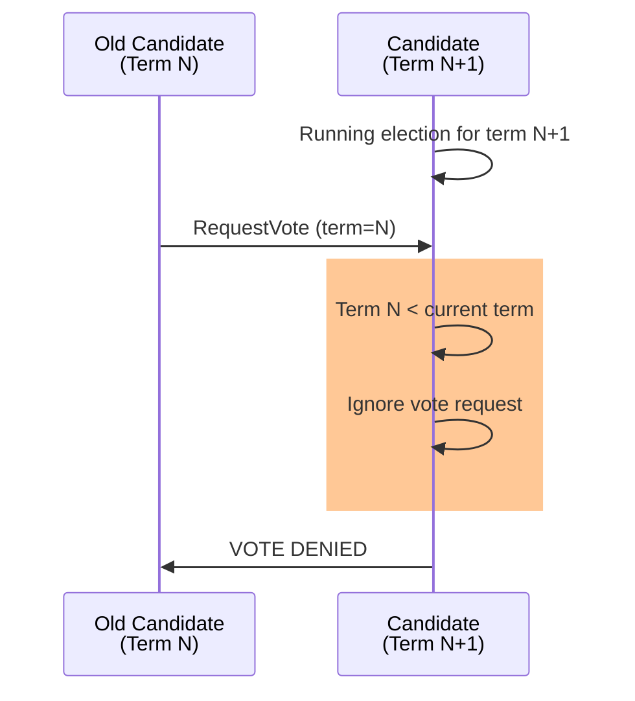

# Test Case 24: Candidate Ignores Lower Term Vote Request

**Given:** you are a candidate
**When:** you receive a request for vote for lower term
**Then:** you ignore it

## Diagram

```mermaid
sequenceDiagram
    participant OldCandidate as Old Candidate<br/>(Term N)
    participant Candidate as Candidate<br/>(Term N+1)
    
    Candidate->>Candidate: Running election for term N+1
    OldCandidate->>Candidate: RequestVote (term=N)
    rect rgb(255, 200, 150)
        Candidate->>Candidate: Term N < current term
        Candidate->>Candidate: Ignore vote request
    end
    Candidate->>OldCandidate: VOTE DENIED
```
