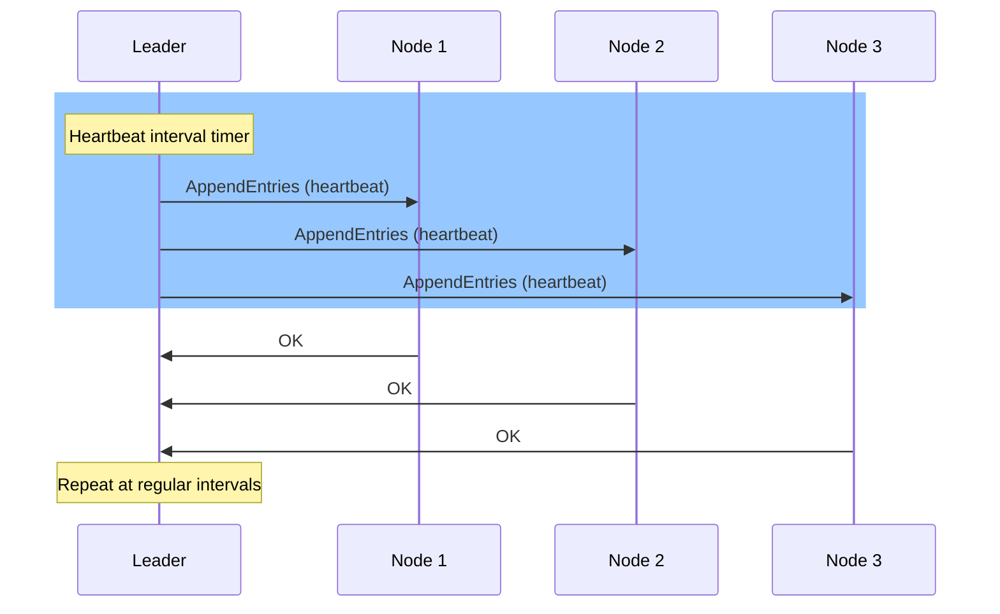

# Test Case 25: Leader Sends Heartbeats at Regular Intervals

**Given:** you are a leader
**When:** 
**Then:** you send a heartbeat to all other nodes (at regular intervals)

## Diagram

```mermaid
sequenceDiagram
    participant Leader as Leader
    participant Node1 as Node 1
    participant Node2 as Node 2
    participant Node3 as Node 3
    
    rect rgb(150, 200, 255)
        Note over Leader: Heartbeat interval timer
        Leader->>Node1: AppendEntries (heartbeat)
        Leader->>Node2: AppendEntries (heartbeat)
        Leader->>Node3: AppendEntries (heartbeat)
    end
    
    Node1->>Leader: OK
    Node2->>Leader: OK
    Node3->>Leader: OK
    
    Note over Leader: Repeat at regular intervals
```
