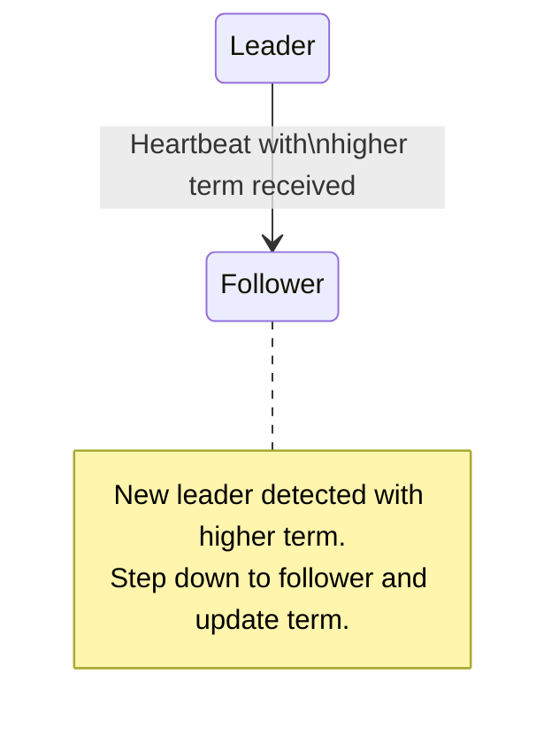

# Test Case 26: Leader Steps Down on Higher Term Heartbeat

**Given:** you are a leader
**When:** you receive a heartbeat of a higher term
**Then:** you become a follower + increment your term

## Diagram

